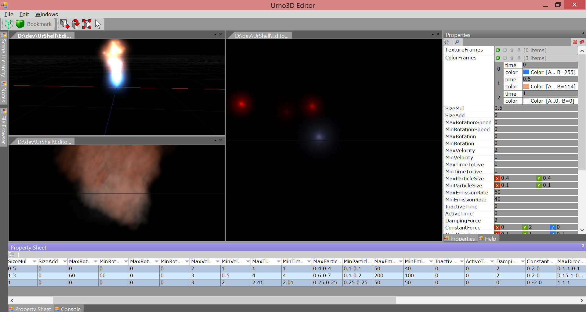

# UrhoEditorSuite

Winforms based document centered IDE for Urho3D

*Summary of a Document*
* Implement ATF IDocument at the least.
* Create a "view" control that is the tab UI for the document.
* Mark the document class with "DocumentFilter" attribute.
* Implement static methods for "NewDocument" and "OpenDocument" and mark them with "NewDocumentFactory" and "OpenDocumentFactory" attributes (as needed, ie. a model viewer does not need the ability to create new documents).
* Implement ATF ICommandClient if you want to support commands
* Implement ATF ISelectionContext if you have multiple possible selections in the document and need to use the PropertyGrid and PropertySheet (datagrid/comparison)
* Implement IPropertyBound if the document IS the selection, in which case the active document will be bound tot he PropertyGrid and all documents of that type will be seen in the PropertySheet
* Implement ILoggingDocument if you want to display log messages
* See "SceneDocument" on how to register ATF CommandInfo's automatic toolbar construction and for creating Menus that only appear for a document type
* See the incomplete "CookerDocument" on more abstract or traditional UI/documents
